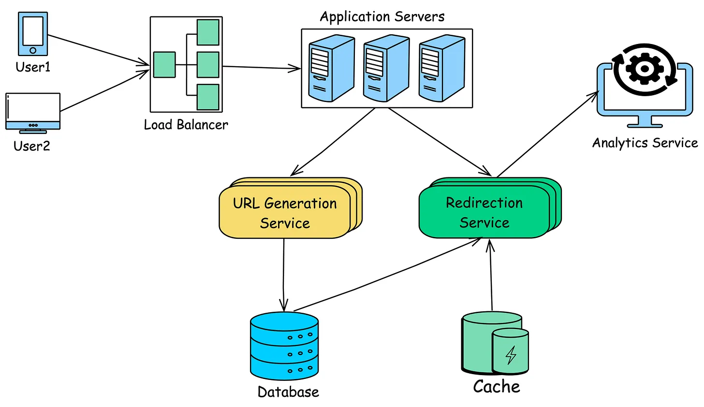
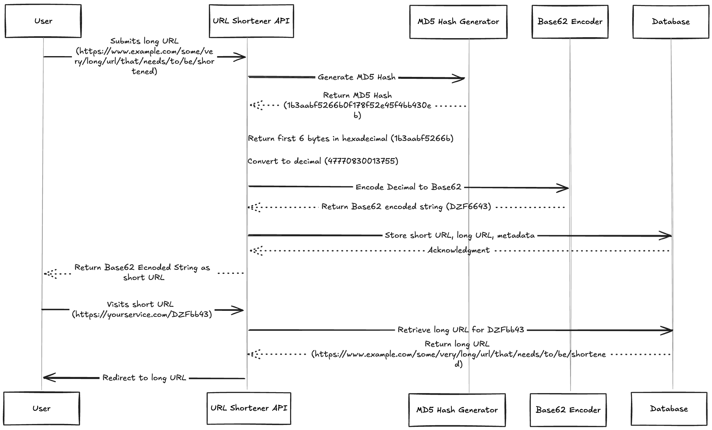
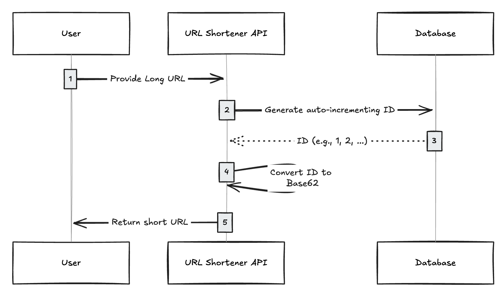

# URLShortener
Design a URL Shortener Service Like TinyURL.

# Functional Requirements:
1. Generate a unique short URL for a given long URL.
2. Redirect the user to the original URL when the short URL is accessed.
3. Support link expiration where URLs are no longer accessible after a certain period.
4. Allow users to customize their short URLs (optional).
5. Provide analytics on link usage (optional).

# Non-Functional Requirements:
1. High availability (the service should be up 99.9% of the time). This is really important to consider because if the service goes down, all the URL redirection will start failing.
2. Low latency (url shortening and redirects should happen in milliseconds).
3. Scalability (the system should handle millions of requests per day).
4. Durability (shortened URLs should work for years).
5. Security to prevent malicious use, such as phishing.

# Capacity Esitmatation

**Assumptions**
* Daily URL Shortening Requests: 1 million requests per day.
* Read-Write ratio is 100:1 (for every URL creation, we expect 100 redirects).
* Peak Traffic: 10x the average load (100 requests per second during peak hours).
* URL Lengths: Average original URL length of 100 characters.

**Throughput Requirements**

Number of seconds in a day : 24*60*60 = 86400

Number of requests expected in a day : 1 million

Average Writes Per Second (WPS): (1,000,000 requests / 86,400 seconds) ≈ 12

**Peak WPS: 12 × 10 = 120**

Since Read-Write ratio is 100:1

Average Redirects per second (RPS): 12 * 100 = 1,200

**Peak RPS: 120 * 100 = 12,000**

**Storage Estimation**
For each shortened URL, we need to store the following information:
* Short URL: 7 characters (Base62 encoded)
* Original URL: 100 characters (on average)
* Creation Date: 8 bytes (timestamp)
* Expiration Date: 8 bytes (timestamp)
* Click Count: 4 bytes (integer)

**Total Storage per URL: 7 + 100 + 8 + 8 + 4 = 127 bytes**

**Total URLs per Year: 1,000,000 × 365 = 365,000,000**

**Total Storage per Year: 365,000,000 × 127 bytes ≈ 46.4 GB**

**Bandwidth Estimation**
The total read bandwidth per day should be based on the actual peak redirects, not the average ones.

Since the ratio of redirects to URL creation is 100:1, if there are 1 million URL shortening requests per day, the number of redirects per day would be:

**1,000,000 URL shortenings × 100 = 100,000,000 redirects per day**

Assuming the HTTP 301 redirect response size is about 500 bytes (includes headers and the short URL).
* Total Read Bandwidth per Day: 100,000,000 × 500 bytes = 50 GB / day
* Peak Bandwidth: If peak traffic is 10x average, the peak bandwidth could be as high as 500 bytes × 12,000 RPS = 6 MB/s

**Caching Estimation**
Since it’s a read-heavy system, caching can significantly reduce the latency for read requests. If we want to cache some of the hot URLs, we can follow the 80-20 rule where 20% of the URLs generate 80% of the read traffic.

As calculated above, Total Storage per URL: 7 + 100 + 8 + 8 + 4 = 127 bytes

Since we have 1 million writes per day, if we only cache 20% of the hot urls in a day, 
Total cache memory required = 1M * 0.2 * 127 Bytes = 25.4 MB.

Assuming a cache hit ratio of 90%, we only need to handle 10% of the redirect requests directly from the database.

**Requests hitting the DB: 1,200 × 0.10 ≈ 120 RPS**

This is well within the capabilities of most distributed databases like DynamoDB or Cassandra, especially with sharding and partitioning.

**Infrastructure Sizing**
To handle the above estimations:
* API Servers: Start with 4-6 instances behind a load balancer, each capable of handling 200-300 RPS.
* Database: A distributed database with 10-20 nodes to handle both storage and high read/write throughput.
* Cache Layer: A distributed cache with 3-4 nodes, depending on the load and cache hit ratio.

# High Level Design

On a high level, we would need following components in our design:

1. Load Balancer: Distributes incoming requests across multiple application servers.
2. Application Servers: Handles incoming requests for shortening URLs and redirecting users.
3. URL Generation Service: Generates short URLs, handles custom aliases, and manages link expirations.
4. Redirection Service: Redirects the users to the original URL.
5. Database: Stores mappings between short URLs and long URLs.
6. Cache: Stores frequently accessed URL mappings for faster retrieval.
7. Analytics Service (optional): Tracks usage statistics like the number of clicks, geographic location, etc.

# Database Design
To choose the right database for our needs, let's consider some factors that can affect our choice:
• We need to store billions of records.
• Most database operations are simple key-value lookups.
• Read queries are much higher than write queries.
• We don't need joins between tables.
• Database needs to be highly scalable and available.

Given these points, a NoSQL database like DynamoDB or Cassandra is a better option due to their ability to efficiently handle billions of simple key-value lookups and provide high scalability and availability.

**Database Schema**
We would need two tables: one for storing url mappings and one for storing user related information.

# Low Level Design

## URL shortening API:
The client executes an HTTP PUT request to the server to shorten a URL. T
he HTTP PUT method is used because the PUT is idempotent and the idempotency quality resonates with the given requirement of 1-to-1 mapping between the long and short URL.

## URL redirection API
The client executes an HTTP GET request to redirect from the short URL to the original long URL. There is no request body for an HTTP GET request.
The server responds with status code 301 Moved Permanently. The status code 301 indicates that the short URL is permanently moved to the long URL. The web crawler updates its records when the status code 301 is received

## URL Generator Service:
The primary function of the service is to generate a short, unique URL for each long URL provided by the user. 

Here are some things to think about when picking an algorithm to shorten the URL:
1. URL Length: Shorter is generally better, but it limits the number of possible distinct URLs you can generate.
2. Scalability: The algorithm should work well even with billions of URLs.
3. Collision Handling: The algorithm should be able to handle duplicate url generations.

## Approach 1: Hashing and Encoding
A common approach for generating short URLs is to use a hash function, such as MD5 or SHA-256 to generate a fixed-length hash of the original URL. This hash is then encoded into a shorter form using Base62. Base62 uses alphanumeric characters (A-Z, a-z, 0-9), which are URL-friendly and provide a dense encoding space. The length of the short URL is determined by the number of characters in the Base62 encoded string. A 7-character Base62 string can represent approximately 3.5 billion unique URLs (62^7).

**Example Workflow:**
1. User submits a request to generate short url for the long url: https://www.example.com/long/url/to/be/shortened .
2. Generate an MD5 hash of the long URL. MD5 produces a 128-bit hash, typically a 32-character hexadecimal string: 1b3aabf5266b0f178f52e45f4bb430eb
3. Instead of encoding the entire 128-bit hash, we typically use a portion of the hash (e.g., the first few bytes) to create a more manageable short URL.
4. First 6 bytes of the hash: 1b3aabf5266b
5. Convert these bytes to decimal: 1b3aabf5266b (hexadecimal) → 47770830013755 (decimal)
6. Encode the result into a Base62 encoded string: DZFbb43
7. The generated short URL DZFbb43, along with the original long URL and other metadata like expiration time as UrlMapping Entity, is stored in the database via urlRepository. 
8. When a user later visits the short URL (e.g., https://yourservice.com/DZFbb43), the service checks the database to retrieve the corresponding long URL for redirection.

The specific choice of 6 bytes (48 bits) is important because it produces a decimal number that typically converts to a Base62 string of approximately 7 characters.

Although this solution works for most cases, it has few issues:
1. It can generate the same shortened url for the identical long url requests.
2. Although rare, collisions can happen, where two different URLs generate the same hash.

**Collision Resolution Strategies:**
1. Re-Hashing: If a collision is detected, the service can re-hash the original URL with a different seed or use additional bits from the original hash to generate a unique short URL.
2. Incremental Suffix: Another approach is to append an incremental suffix (e.g., "-1", "-2") to the short URL until a unique key is found.

## Approach 2: Unique ID Generation
Instead of hashing, another method to generate short URLs is to use incremental IDs. In this approach, each new URL that is added to the system is assigned a unique, auto-incrementing ID.

For example, the first URL might be assigned ID 1, the second URL 2, and so on. Once the ID is generated, it is converted into a shorter, URL-friendly format using Base62 encoding. This encoded string becomes the short URL. Because the IDs are generated incrementally, each new ID is unique and sequential. There is no possibility that two different URLs will receive the same ID, as long as the ID generation mechanism (e.g., a database with an auto-incrementing primary key) is functioning correctly.

While the incremental ID approach is straightforward and collision-free, there are a few considerations:
1. Predictability: Incremental IDs are predictable, which means that someone could potentially infer the number of URLs shortened by your service or guess other users' URLs by simply incrementing the short URL.
2. Mitigation: You can add a layer of obfuscation by encoding the ID with a random seed or shuffling the ID before encoding it with Base62. Distributed ID generation strategies (like Twitter’s Snowflake) can be used to maintain scalability while preserving uniqueness.
3. Scalability: If not designed properly, a single point of ID generation (like a centralized database) can become a scalability bottleneck.

## Approach 3: Custom Aliasing
Custom aliasing allows users to specify their own short URL instead of accepting a system-generated one. This feature is especially useful for branding or memorable URLs.

**Custom Alias Validation -**
* Uniqueness Check: The service must ensure that the custom alias provided by the user is unique and not already in use. This requires a lookup in the database to verify that the alias does not exist.
* Character Validation: Custom aliases should be validated to ensure they contain only allowed characters (e.g., alphanumeric characters, hyphens). This prevents the creation of problematic or non-URL-friendly aliases.
* Reserved Aliases: Some aliases might be reserved for internal use (e.g., "help", "admin", "about"). The Service Layer should check against a list of reserved words to prevent users from using these.

**Custom Alias Storage -**
Once validated, the custom alias is mapped to the original URL and stored in the database, similar to system-generated short URLs.
Conflict Resolution: If the requested custom alias is already taken, the Service Layer should return an appropriate error message or suggest alternatives.

# Link Expiration
Link expiration allows URLs to be valid only for a specified period, after which they become inactive.

**Expiration Logic:**
* Background Jobs: A background job or cron job can be scheduled to periodically check for expired URLs and mark them as inactive or delete them from the database.
* Real-Time Expiration: During the redirection process, the service checks whether the URL has expired. If expired, the service can return an error message or redirect the user to a default page.

# Redirection 
When a user accesses a short URL, this service is responsible for redirecting the user to the original URL.

This involves two key steps:
Database Lookup: The Service Layer queries the database to retrieve the original URL associated with the short URL. This lookup needs to be optimized for speed, as it directly impacts user experience.
Redirection: Once the long URL is retrieved, the service issues an HTTP redirect response, sending the user to the original URL.

**Example Workflow:**
1. A user clicks on https://yourservice.com/DZFbb43.
2. The Redirection Service receives the request and extracts the short URL identifier (DZFbb43).
3. The service looks up abc123 in the database or cache to find the associated long URL.
4. The service issues a 301 or 302 HTTP redirect response with the Location header set to the long URL (e.g., https://www.example.com/long/url/to/be/shortened).
5. The user's browser follows the redirect and lands on the original URL.

# Caching for Performance
Store frequently accessed short URL-to-long URL mappings in an in-memory cache like Redis or Memcached. This reduces the need to query the database on every request, significantly improving response times. The Redirection Service should first check the cache before querying the database.

# Analytics Service
If the service needs to track analytics, such as the number of times a short URL is clicked, a separate analytics service can be introduced.
Event Logging: Use a message queue (e.g., Kafka) to log each click event. This decouples the analytics from the core redirection service, ensuring that it doesn’t introduce latency.
Batch Processing: Process logs in batches for aggregation and storage in a data warehouse for later analysis.

# Addressing Key Issues and Bottlenecks

## Scalability

* API Layer: Deploy the API layer across multiple instances behind a load balancer to distribute incoming requests evenly.

* Sharding: Implement sharding to distribute data across multiple database nodes. 

  Range-Based Sharding: If you are using an auto-incrementing ID as the shard key, the first shard might store IDs 1 to 1,000,000, the second shard 1,000,001 to 2,000,000, and so on. If your data isn’t evenly distributed, one shard may become much larger than others, leading to uneven load distribution (known as a "hotspot").

  Hash-Based Sharding: It involves applying a hash function to the shard key to determine which shard the data should go to. For example, you might hash the short URL identifier and then take the modulo with the number of shards to determine the shard (e.g., hash(short_url) % N where N is the number of shards).When scaling out (adding new shards), re-hashing and redistributing data can be challenging and requires consistent hashing techniques to minimize data movement when adding or removing shards.

## Availability
* Replication: Use database replication to ensure that data is available even if some nodes fail.
* Failover: Implement automated failover mechanisms for the API and data store layers to switch to backup servers in case of failure.
* Geo-Distributed Deployment : Deploy the service across multiple geographical regions to reduce latency and improve availability.

## Handling Edge Cases
* Expired URLs : If the short URL has expired, the service should return a meaningful response (eg.. HTTP 410) rather than attempting to redirect.
* Non-Existent URLs : If the short URL does not exist in the database, the service should handle this gracefully (eg.. HTTP 404 Not Found status code).
* URL Conflicts : If a conflict arises where multiple long URLs could map to the same short URL (due to a hash collision or manual alias conflict), the service should have a strategy to resolve this. Implement collision detection during URL creation to prevent conflicts, and ensure that the Redirection Service always resolves to the correct long URL.

## Security
* Rate Limiting : To prevent abuse (e.g., spamming the service with thousands of URLs), implement rate limiting at the API layer.
* Input Validation : Ensure that the URLs being shortened do not contain malicious content.
* HTTPS : All communication between clients and the service should be encrypted using HTTPS to prevent eavesdropping and man-in-the-middle attacks.
* Monitoring and Alerts : Set up monitoring for unusual activity patterns and trigger alerts for potential DDoS attacks or misuse.
